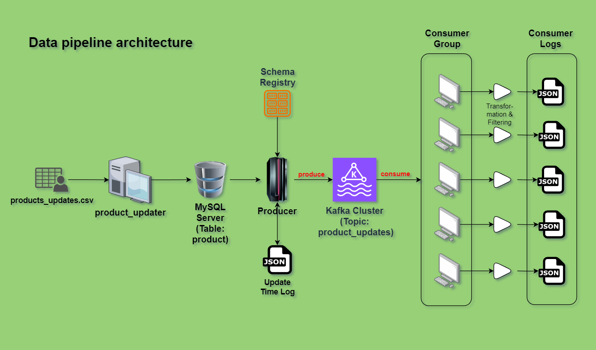
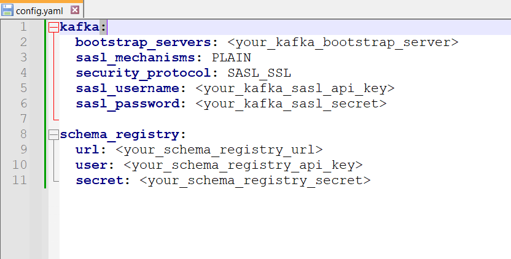

# Data Streaming Using Confluent Kafka Cluster

This repository contains a data pipeline project that leverages the power of Apache Kafka, specifically Confluent Kafka, to build a scalable and efficient data processing system. The project is organized using a microservices architecture and is orchestrated using Docker Compose to make it easy to set up, manage, and simulate various components of the pipeline.

## Introduction

A data pipeline is a fundamental component of modern data-driven organizations. It allows for the efficient and reliable flow of data from various sources to multiple destinations, facilitating real-time data processing, analysis, and storage. Apache Kafka is a distributed streaming platform that is well-suited for building robust data pipelines.

### Key Features:

**Kafka Cluster**: The core of this project is a Confluent Kafka cluster, which is used to collect, distribute, and process data streams. This Kafka cluster provides high availability and fault tolerance for your data.

**Microservices**: The data pipeline is organized into microservices that handle different aspects of data processing. This modular approach makes it easy to add or modify components as your project grows.

**Docker Compose**: The entire setup is managed through Docker Compose, which enables you to simulate a distributed environment with ease. It simplifies the deployment and scaling of the microservices.

**Real-time Data Processing**: With Kafka at the center, this pipeline allows you to perform real-time data processing, making it suitable for a wide range of applications, from log processing to IoT data handling.

## Data pipeline

The data pipeline architecture for this project is designed to efficiently manage the flow of data across various stages, from updating product records in a MySQL database to final processing and storage. It starts with the "Product_updater," responsible for making updates to product records within the MySQL database. Once these updates occur, the "Producer" component ingests the data changes from the database, records a timestamp in a JSON log, and dispatches the updated messages to a designated Kafka cluster topic known as "product_updates." Within this Kafka topic, a "Consumer Group" is formed, comprising five consumers. Each consumer within the group plays a crucial role by receiving, filtering, and performing transformations on the incoming messages. After the necessary processing, these consumers independently store the processed data in their respective JSON logs. The pipeline's architecture is streamlined, scalable, and designed for efficient data management, ensuring that updates to product records are securely recorded and processed within the Kafka ecosystem.

<!-- <br> -->
<!-- <div style="text-align:center">
  
</div> -->
<!-- <br> -->


[This architectural diagram](images/data-pipeline-arch.png) illustrates the various components and their interactions within the data pipeline. This visual representation provides a clear overview of the entire system, showcasing how data flows through the different stages, from database updates to final JSON log storage by the consumers.


## Project structure

### Top-Level Directories

- **product_updater**: This directory contains the component responsible for updating records in the MySQL database.

- **producer**: The producer component that takes updated records from the database and sends it to the Kafka cluster.

- **consumer**: This directory serves as the component responsible for consuming and processing data from the Kafka topic, playing a role in the data pipeline's real-time data processing and storage.

- **data**: The data directory stores the source data used by product_updater to push records to the database.

- **time_track**: Contains the `last_read_timestamp.json` file, which records the last read timestamp for the producer.

- **consumer_logs**: This directory houses five subdirectories (consumer_1 to consumer_5), each of which serves as the final destination for data storage and processing.

### `consumer_logs` Subdirectories:
- consumer_1: The first of five subdirectories within consumer_logs.
- consumer_2: The second subdirectory within consumer_logs.
- consumer_3: The third subdirectory within consumer_logs.
- consumer_4: The fourth subdirectory within consumer_logs.
- consumer_5: The fifth subdirectory within consumer_logs.

### Data Logging:
Each `consumer_logs` subdirectory contains a file named `consumer_log.json`, which is used for appending and storing data processed by the respective consumer.

This project structure organizes the components, data, and logs related to your data pipeline in a structured manner, making it easier to manage and maintain the various parts of the system.

## Prerequisites

- **Python 3.8 or Above**: Python version 3.8 or higher is required for running this project's codebase effectively.
- **Docker Runtime and Docker Compose**: Docker runtime and Docker Compose are necessary for managing and orchestrating the Docker containers used in this project.
- **Kafka Cluster**: A functional Kafka cluster should be set up and running. In my case, Confluent Kafka is used for this project.
  - Establish a Kafka cluster and proceed to generate a topic named `product_updates` configured with 10 partitions.
- **Schema Registry**: To support data serialization and schema management, ensure that a Schema Registry is set up and integrated with your Kafka cluster. This is particularly important for maintaining data integrity and compatibility within the pipeline.
  - Formulate an Avro schema for the **value** using the provided `product_value_avro_schema.json` file located within the project. The schema will be used by the producer and consumers to serialize and deserialize the data.

Having these prerequisites in place is essential for the successful operation of the data pipeline project.

## Getting Started
1. Directly beneath each `producer` and `consumer` directory, establish a new directory titled `conf`. Within this `conf` directory, store your Kafka and Schema Registry credentials and configuration details in a `config.yaml` file, structured as follows:

<!-- <br> -->
<!-- <div style="text-align:center">
  
</div> -->
<!-- <br> -->


2. Ensure that the value of `last_read_timestamp` in [last_read_timestamp.json](time_track/last_read_timestamp.json) is reset to `null` for each individual implementation, such that it accurately reflects the specific timestamp requirements.


3. Ensure that the five subdirectories, as described in the `Project Structure` section, are located within the `consumer_logs` directory.

## Launching the Project

In the project's root directory, execute the following command:
```bash
$ docker compose up
```

> Please note that the source files contain only 50 records. Therefore, once the producer has successfully transmitted 50 messages, you can exit the program by pressing `Ctrl-C`.

## Results:

Here are the some example results:

1. Processed data is neatly stored in their respective designated JSON files.
2. Each consumer effectively handles two partitions, as illustrated as an example below:
   - Consumer 1 manages partitions 4 and 5.
   - Consumer 2 handles partitions 2 and 3.
   - Consumer 3 is responsible for partitions 6 and 7.
   - Consumer 4 oversees partitions 0 and 1.
   - Consumer 5 is in charge of partitions 8 and 9.
3. The data undergoes thorough transformation and processing, ensuring accurate and reliable results as shown.
<!-- <br> -->
<!-- <div style="text-align:center">
  
</div> -->
<!-- <br> -->


The category is now capitalized, and a new column named `discount_price` has been introduced. For each item falling under the category `CAT_5`, the `discount_price` column reflects a 20% reduction from the original price.

## Afterwords

- Special thanks to **Grow Data Skills** for their invaluable guidance, support, and expertise throughout the development of this project. Their contributions have been instrumental in its success (© Grow Data Skills).

- I am grateful to **Confluent Kafka** for providing the robust Kafka server infrastructure that forms the backbone of this data pipeline. Their dedication to excellence has greatly contributed to the reliability and efficiency of this project (© Confluent Kafka).

